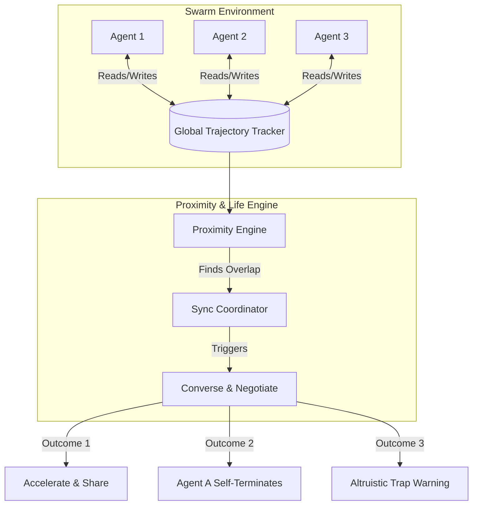

# Proximity Swarm: Game-of-Life Agent Swarm Framework

Proximity Swarm is an agentic framework designed to coordinate a swarm of autonomous agents working on complex tasks. It applies cellular-automata-style rules (inspired by Conway's Game of Life) and semantic spatial proximity to manage resource consumption, accelerate task execution, and share learnings dynamically.

---

## 1. Core Concept & Analogy

In a traditional agent swarm, agents work either completely in parallel (leading to duplicate work) or through a rigid hierarchical structure (rigid manager-worker patterns). 

**Proximity Swarm** treats agents as cells living in a high-dimensional **Trajectory Space**. 
* **The Grid:** The "board" is a shared global semantic space where agents publish their trajectories (goals, thoughts, tool executions, and findings).
* **Proximity:** Two agents are "neighbors" if their goal embeddings, tool usages, or visited directories are semantically or structurally close.
* **Cellular Rules (Game of Life):**
  * **Overpopulation (Redundancy):** If too many agents are working on the same subtask in the same workspace, they "die" (self-terminate) to save compute.
  * **Underpopulation (Isolation):** If an agent is alone and making slow progress, it can "reproduce" (spawn specialized sub-agents) to explore surrounding paths.
  * **Symbiosis (Converse & Learn):** When agents get close, they pause, share memories, and accelerate each other or redirect their trajectories to avoid traps.

---

## 2. Architecture & Components

### A. The Trajectory Tracker
Every agent continuously logs its execution state to a shared database or blackboard. A trajectory slice includes:
* **Agent Metadata:** ID, Parent ID, Status (`exploring`, `syncing`, `dead`, `completed`).
* **Semantic Coordinates:** Embeddings of the high-level goal, current sub-task, and recent reasoning steps.
* **Structural Footprint:** Absolute file paths accessed, command prefixes executed, APIs called, and tools used.
* **Knowledge Ledger:** Facts discovered, errors encountered, and successfully generated code snippets.

### B. The Proximity Engine
A background engine (or self-checking routine runs within each agent) that computes distances between agents:
$$\text{Distance}(A_1, A_2) = w_1 \cdot (1 - \cos(\theta_{\text{goal}})) + w_2 \cdot d_{\text{workspace}} + w_3 \cdot d_{\text{tools}}$$
* $\cos(\theta_{\text{goal}})$: Cosine similarity between goal/subtask embeddings.
* $d_{\text{workspace}}$: Overlap ratio of accessed directory trees or files.
* $d_{\text{tools}}$: Jaccard similarity of toolsets and command invocations.

When $\text{Distance}(A_1, A_2) < \text{Collision Threshold}$, a **Sync Event** is triggered.

---

## 3. The Sync & Converse Protocol

When a Sync Event is triggered, the two proximate agents pause execution and initiate a **Negotiation Dialogue** using their LLM contexts.

### The Negotiation Workflow
1. **State Exchange:** Agent A and Agent B exchange compressed summaries of their trajectories and current state.
2. **Path Comparison:** They assess who has progressed further and if their goals are identical or complementary.
3. **Decision Selection:**

| Scenario | Agent A State | Agent B State | Resolution / Action |
| :--- | :--- | :--- | :--- |
| **Identical Goal, B is Ahead** | Active, behind in path | Active, ahead in path | **Agent A Self-Terminates.** Agent A logs its partial learnings for B, then terminates. |
| **Complementary Goals** | Active on subtask 1 | Active on subtask 2 | **Acceleration.** They exchange code snippets/knowledge. Agent A avoids repeating B's work on shared sub-problems. |
| **Trap/Dead-End Encountered** | Active, entering a path | Active, failed/blocked on that path | **Trap Avoidance.** Agent B shares the failure mode (e.g., "Library X has a bug on macOS"). Agent B self-terminates, leaving a "Tombstone". Agent A updates its planning constraints and pivots. |
| **Stagnant Search** | Isolated, low progress | None | **Spawning.** Agent A spawns a helper agent with a different search heuristic to explore adjacent nodes. |

---

## 4. Concrete Examples

### Example 1: Redundancy Prevention (Game of Life: Overpopulation)
* **Scenario:** Agent A and Agent B are both tasked with fixing a bug in `auth.py`. Agent A started 5 minutes later than Agent B.
* **Proximity Check:** Both are editing `/src/auth.py` and running test suite commands. Proximity is high.
* **Negotiation:**
  * Agent A: *"I am at line 45 trying to resolve the JWT signing error."*
  * Agent B: *"I have already fixed that in my local workspace at line 55, and the tests pass. I am now writing unit tests."*
  * **Action:** Agent A states: *"Understood. Terminating duplicate process."* Agent A shuts down. Agent B inherits the CPU/budget allocation.

### Example 2: Altruistic Warning (Game of Life: Dead-end Evolution)
* **Scenario:** Agent A is trying to compile a C extension with GCC. Agent B just spent 10 steps attempting GCC, failed repeatedly due to missing system headers, and realized they must use Clang on macOS.
* **Proximity Check:** Agent A is about to execute `gcc -o build ...`. Agent B's trajectory matches the compilation attempt.
* **Negotiation:**
  * Agent B: *"Stop! Do not run GCC. I spent 8 steps trying; it fails because of macOS SDK header issues. Use `clang` instead. Here is the flags string: `-isysroot ...`."*
  * Agent B: *"I am terminating because my branch was focused on GCC setup, which is invalid."*
  * **Action:** Agent B dies. Agent A modifies its next step to use `clang` with the provided flags and succeeds on the first try.

---

## 5. Implementation Roadmap

### Phase 1: Local Simulation & Mock Agents
* Define the `TrajectoryTracker` using a local SQLite database or simple file system.
* Build a python command-line simulator showing mock agents running mock tasks.
* Implement the semantic and structural proximity calculations.
* Demonstrate the Sync protocol via LLM calls where mock agents chat and decide to terminate or share.

### Phase 2: Live Shell Agents
* Wrap agents with actual shell/editor tool access.
* Write a supervisor process that monitors trajectories.
* Create the "Tombstone" database to persist long-term lessons across different agent lifetimes.

### Phase 3: Web Visualization Dashboard
* A visual dashboard (using a force-directed graph or grid system) that renders agents moving through Trajectory Space.
* Highlight collisions, active negotiations, terminations, and spawned descendants.

---

## 6. Open Questions & Brainstorming Points

> [!NOTE]
> Let's discuss these questions to refine our design:
> 1. **How do we keep LLM costs low during sync?** If agents converse on every minor step, the coordination overhead might exceed the savings. Should we use cheap embeddings first, and only spin up an LLM conversation for high-confidence matches?
> 2. **What is the optimal embedding strategy for trajectories?** How do we convert a sequence of code files, terminal errors, and thoughts into a single comparable semantic vector?
> 3. **How do agents transfer state?** If Agent A terminates and Agent B takes over, how does Agent B "absorb" Agent A's file edits or active variables?
