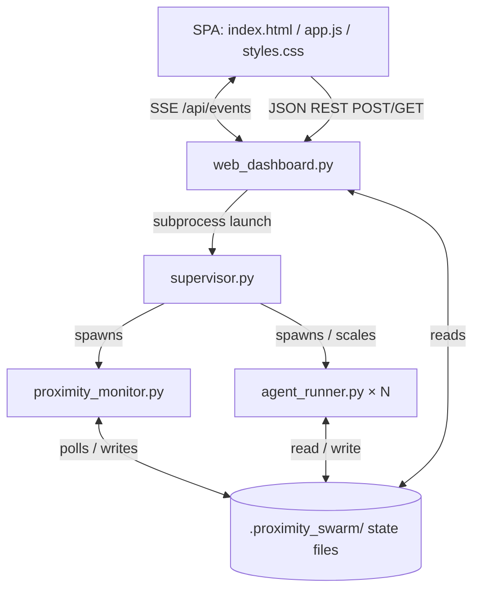

# Proximity Swarm V3 — Harness Design & Backend Integration

This is the **authoritative specification** for the Proximity Swarm V3 research harness. To align with the goal of using a swarm of small LLMs to collaboratively solve complex multistep logic problems (like proofs), the UI has transitioned from a general-purpose code IDE into a **Logic Exploration Harness**. 

---

## 1. Design philosophy

The dashboard is a **Research Harness**, designed to observe, evaluate, and steer a massive search graph of logic steps. The information architecture follows six principles:

1. **Three persistent zones, one focus area.** A *Branch rail* (left), a *Logic Exploration Tree* (center), and a *Judge's Feed* (right). Everything else is summoned.
2. **Selection drives everything.** Click a logic node (agent) once, and the stage and Judge's feed follow it.
3. **Deep / rare views are drawers.** Trace, Memory, budget controls, and pending spawn approvals are pulled up when needed, then dismissed.
4. **Decisions come to you.** Pending spawns, blocker evaluations, and branch collisions surface inline in the Timeline **and** as a clickable count in the status bar.
5. **No File Editors.** The focus is on the semantic logic and proof validation, not raw code editing.
6. **Minimalist Data-Dense Chrome.** Flat gray surfaces, minimal radius. Activity bar on the left, status bar at the bottom.

---

## 2. System architecture

A single-page application that synchronizes in real time with an event-driven Python HTTP/SSE server, mapping the local file-based logic state into an interactive search graph.



---

## 3. Layout

```
┌──────────────────────────────────────────────────────────────────────────────┐
│ ⬡ Proximity Swarm V3 — <project>            ▶ Running   ⚙ settings   + New swarm│  
├──┬───────────┬───────────────────────────────────────────┬─────────────────────┤
│⬡ │ BRANCHES N│  [ ◆ Exploration Tree │ 💬 Timeline ]     │ The Judge's Feed    │
│◆ │ ▾ Orchestr│                                             │                     │
│💬│  001 Lead │         (001)                               │ ⚖️ Evaluation (003) │
│🔍│ ▾ Path A  │          /  \                               │ Valid step: True    │
│🔔│  002 Valid│     (002)    (003◉)                         │                     │
│  │  003 Eval │      /          \                           │ ⚠️ Collision (006)  │
│⚙ │ ▾ Path B  │   (004)       (006◍)                        │ Semantically similar│
├──┴───────────┴───────────────────────────────────────────┴─────────────────────┤
│ ❯ Enter human intuition, command, or @agent_id pivot message…                   │  
├───────────────────────────────────────────────────────────────────────────────┤
│ ⎇ project  ● Running  ◆ N logic steps  ⛁ quota used/cap   🔔 K decisions       │  
└───────────────────────────────────────────────────────────────────────────────┘
```

---

## 4. Components

### 4.1 Title bar
Brand (`⬡ Proximity Swarm V3`) + project label · **Running/Idle/Completed** chip · **settings ⚙** menu (holds the storage **clean** actions: logs, workspaces, collisions, tombstones/gravestones, memory) · **+ New swarm** button.

### 4.2 Activity bar (far left)
Icon switcher: **Branches** (default), **Swarm Tree**, **Timeline**, **Search**, **Activity** (bell), and **Settings**. 

### 4.3 Branches rail (left — the *who*)
A hierarchical tree grouped by logic branches (sub-swarms). Each row shows **status badge (Valid, Evaluating, Dead End) · role · truncated logic step hypothesis · progress bar**. 

### 4.4 Center stage — the **Exploration Tree ⇄ Timeline** toggle
**Exploration Tree (Search Graph)**. 
- **Node label** — agent ID + logic step tag.
- **Solid directional edge** — parent → child logical progression (spawns).
- **Dashed amber link + glowing ring** — a cross-branch **collision** (Proximity Engine detected identical logic paths).
- **Node fill / state** — green = validating, amber = syncing (collision), gray = idle, check = valid proof step, skull = Gravestone/Tombstone.
- **Attention ring** — blue ring = needs human intuition/spawn approval, orange ring = marked for pruning (quota).

**Timeline — conversation/activity stream**. Live agent narration, logic formulation, and inline decision cards. 

### 4.5 The Judge's Feed (right — the *evaluations*)
Replaces the code editor. When a node is selected, this panel streams the Judge's evaluation of the logic step. It shows the reasoning behind validation success/failure, collision resolution decisions, and pruning recommendations.

### 4.6 Inspector (on-demand, slides from the right)
Four sub-tabs scoped to the selected logic node:
- **Overview** — current logic hypothesis, semantic similarity metrics to peers.
- **Quotas** — this branch's compute limit and priority.
- **Trace** — the agent's causal lineage (spawns, state transitions).
- **Memory (Gravestones)** — similar past failed branches to avoid.

### 4.7 Activity / Logs drawer (on-demand, rises from the bottom)
- **Decisions & collisions** — pending spawn approvals (hiring), blocker resolutions, live collisions, branch prune candidates, and new Gravestones.
- **Logs** — the `monitor.log` stream.

### 4.8 Command bar (persistent, bottom)
The agentic REPL: `❯ Enter human intuition, command, or @agent_id pivot message…`. Accepts macro goals, `/commands` (e.g. `/quota`, `/prune`, `/clean`, `/trace`).

### 4.9 Init modal (empty state)
When `agents.length === 0`, a modal prompts to define the root problem. Includes **provider** select (for the swarm and the Judge), and a **compute quota** control. The system uses the local LLM to recommend initial divergent paths.

---

## 5. Interaction & state model

| Trigger | State update | Visual effect |
|---|---|---|
| **Single-click** agent | `selectedAgentId` | Map node highlights · Judge's Feed populates with evaluation data. |
| **Double-click** / details icon | `inspectorOpen` | Inspector slides in for that agent. |
| Toggle Tree / Timeline | `stageView` | Center swaps; selection preserved. |
| Decision arrives (SSE) | `decisions[]` | Inline Timeline card **+** status-bar "K decisions" increments. |
| Quota runs low (SSE) | agent budget | Target node gets an **orange ring** (prune candidate). |
| Collision detected (SSE) | `collisions[]` | Dashed redundancy link + ring on Tree; Judge begins evaluation. |

---

## 6. Backend integration (REST endpoints)

*(Mirrors the backend routes in `web_dashboard.py`)*

| Endpoint | Method | Purpose |
|---|---|---|
| `/api/state` | GET | Full swarm snapshot (bootstraps the SPA). |
| `/api/agents` | GET | Agent list (logic nodes). |
| `/api/trace/<id>` | GET | Causal trace (→ Inspector ▸ Trace). |
| `/api/memory` | GET | Episodic memory / Gravestones list (→ Inspector ▸ Memory). |
| `/api/collisions` | GET | Active logic collisions. |
| `/api/tombstones` | GET | Dead/pruned logic records (Gravestones). |
| `/api/resolve/<id>` | POST | Resolve a blocker or collision manually. |
| `/api/prune/<id>` | POST | Prune a leaf logic branch. |
| `/api/budget` | POST | Set the global compute quota (status bar). |
| `/api/clean` | POST | Storage cleanup (settings menu). |

---

## 7. Feature coverage map (design_doc → UI)

Every backend feature from `design_doc.md` has a UI home in this Harness layout.

| design_doc feature | UI surface |
|---|---|
| §1 Supervisor / monitor / runners | Whole dashboard (live state via SSE). |
| §2 Storage layout | Settings ▸ Clean targets; Logs drawer. |
| §3 Clean commands | **Settings ⚙ menu** + `/clean` in command bar. |
| §4 Swarm designer + LLM recommendations | **Init modal** (expandable agent designer). |
| §5 Deconfliction & **The Judge** | **Exploration Tree** redundancy link + **Judge's Feed** + `/api/resolve`. |
| §6 Verification & tests | Surfaced indirectly via step progress (Valid/Evaluating); logs in Logs drawer. |
| §7 Hierarchical artifact synthesis | **Report** button opens a Combined Proof/Synthesis modal. |
| §8 Designer UI / command help | Init modal + command-bar placeholder/hints. |
| §9 Episodic memory (Gravestones) | **Inspector ▸ Memory** (+ swarm-wide filter); `/memory`. |
| §10 Three-tier hierarchical scaling | **Tree branch clusters** (sub-swarms exploring logic paths). |
| §11 Dynamic proximity weighting | Drives collision weighting on the Tree. Phase shown in Inspector ▸ Overview. |
| §12 Causal graph tracing | **Inspector ▸ Trace**; `/trace`. |
| §13 Self-healing verification loop | Heals shown in Trace; exhaustion → Gravestone on Tree (skull icon). |
| §14 Quotas & leaf pruning | **Status-bar quota**, prune candidates + `/prune` in Activity drawer. |
| §15 Proximity & novelty-driven spawning | Spawn requests as **Timeline cards**; new child appears in the Tree. |
| §16 Interactive Pivoting | Command bar accepts `@agent_id` messages to inject intuition. |
