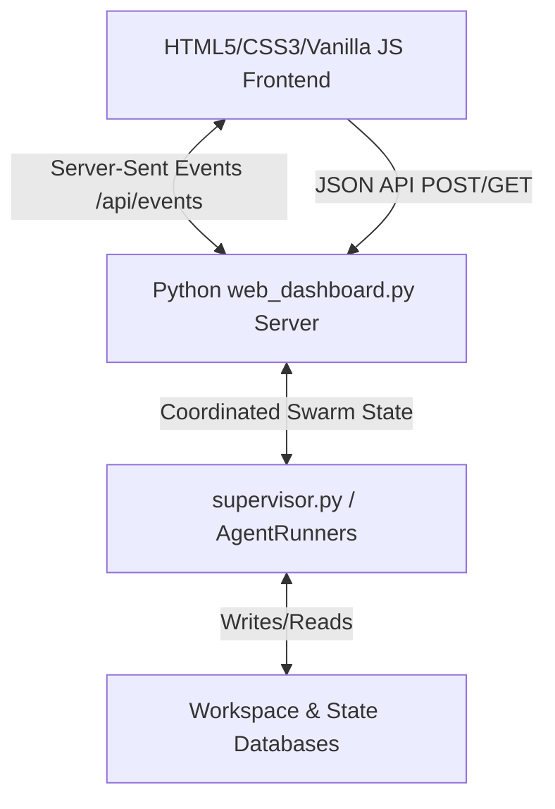

# Proximity Swarm V3 — UI Design & Backend Integration Document

This document explains the architecture, interface components, state management, and communication protocols of the **Proximity Swarm V3** web dashboard, detailing how the user interface components interact with each other and coordinate with the backend.

---

## 1. System Architecture Overview

The system is structured as a single-page application (SPA) that synchronizes in real time with an event-driven Python HTTP/SSE server.



---

## 2. Frontend Interface Components & Workflows

The dashboard consists of a multi-panel workspace split into two main visual regions, with an initialization layer that controls application startup.

### A. Swarm Initialization Overlay (`#init-overlay`)
* **Role**: Prompts the user to configure and launch a swarm task when no agents are running.
* **UI Elements**:
  * **Goal Textarea (`#init-goal`)**: Captures the prompt defining the task.
  * **LLM Provider Select (`#init-provider`)**: Configures the LLM backend (e.g., `Ollama`, `Gemini`).
  * **Compute Budget Input (`#init-budget`)**: Defines the global cap for token utilization.
  * **Launch Button (`#init-launch-btn`)**: Starts the initialization process.
* **Control Flow**:
  1. The overlay automatically renders as a blurred dark backdrop over the unpopulated workspace when the dashboard state shows `agents.length === 0`.
  2. Clicking "Initialize Swarm" calls `initLaunch()` which first posts the selected provider configuration to `/api/config` and then triggers `/api/run`.
  3. Once the swarm launches successfully, the overlay fades out, and the main cluster visualization animates.

---

### B. Left Panel: Real-Time Cluster Map & Visualizer
* **Role**: Visualizes the hierarchical relationship, task proximity, and active state of the agents.
* **Key Visual Elements**:
  * **Nodes**: Circles representing active agents, labeled by ID. Colors represent states (Green: Exploring; Orange: Syncing; Red: Blocker/Error).
  * **Hierarchical Clusters**: Nested transparent boundary circles representing supervisor-child relations.
  * **Proximity Springs**: Physics-based links showing task similarity. Glowing rings highlight "Redundancy Check" zones where agents are negotiating duplicate files/goals.
  * **Interactivity**: Clicking any node selects that agent (`UIState.selectedAgentId`), focuses the right-panel editor on the agent's files, and displays detailed similarity metrics in the sidebar.

---

### C. Right Panel: Dynamic Split Pane
The right panel contains a tabbed header allowing the operator to toggle between Code Editing and Swarm Monitoring.

```
┌───────────────────────────────────────┐
│ [ CODE EDITOR ]  |   [ ACTIVITY (2) ] │
├───────────────────────────────────────┤
│                                       │
│  Workspace selector & Code Viewer     │
│  showing generated files in real      │
│  time...                              │
│                                       │
└───────────────────────────────────────┘
```

#### 1. Code Editor Tab (`editor`)
* **Role**: Displays the files created and modified by the selected agent in real time.
* **UI Elements**:
  * **Agent Selector Dropdown**: Toggles between agent workspaces.
  * **Active File Dropdown**: Displays a compact dropdown of files generated by the selected agent.
  * **Code Viewer**: A scrollable dark text pane showing file contents with line counts.
* **Control Flow**:
  1. Selecting an agent (either via dropdown or map node) requests the agent's files from `/api/workspaces/<agent_id>`.
  2. The data populates the dropdowns and renders the code viewer contents.
  3. Change listeners detect dropdown selections and trigger local state updates and re-renders.

#### 2. Activity Tab (`activity`)
* **Role**: Houses the critical system feedback widgets and decision prompts.
* **Visual Widgets**:
  * **Global Token Budget**: A bar showing token usage relative to the global session budget. Clicking the number opens an inline editor.
  * **Per-Agent Budget Tree**: Tree list of active agents, their output tokens, and budget caps, with a "Set budget" redistribution editor.
  * **Pending Decision Cards**: Prompts for supervisor actions like approving spawns or selecting blocker workarounds (Bypass, Workaround, Kill).
  * **Collisions & Tombstones**: Lists active collision events and dead/pruned agent logs.

---

## 3. Communication Protocols & API Schema

The frontend communicates with the Python backend using REST JSON endpoints and a persistent SSE connection.

### A. Server-Sent Events (SSE) `/api/events`
* **Protocol**: Persistent HTTP connection (`EventSource`).
* **Payload**: Pushes the global `SwarmState` hash and updates to the client whenever the supervisor modifies memory, spawns new agents, resolves conflicts, or completes steps.
* **Handler**: `connectSSE()` listens to the socket. If the returned state hash changes, it triggers `render()`.

### B. REST Endpoints

| Endpoint | Method | Request Payload | Response | Description |
|---|---|---|---|---|
| `/api/state` | GET | None | `SwarmState` JSON | Retrieves the initial full swarm status. |
| `/api/config` | POST | `{ "llm_provider": "ollama" }` | `{ "success": true }` | Dynamically updates the supervisor's active LLM model. |
| `/api/run` | POST | `{ "goal": "...", "agents": [], "budget": 20000 }` | `{ "success": true, "message": "..." }` | Initializes and launches the supervisor swarm. |
| `/api/workspaces/<agent_id>` | GET | None | `{ "files": [...], "contents": {...} }` | Fetches file names and raw text content from the agent's work directory. |
| `/api/approve/<agent_id>` | POST | None | `{ "success": true }` | Approves a child spawn request. |
| `/api/reject/<agent_id>` | POST | None | `{ "success": true }` | Denies a child spawn request. |
| `/api/resolve/<agent_id>` | POST | `{ "choice": 1 }` | `{ "success": true, "message": "..." }` | Resolves blocker errors (1: Workaround, 2: Bypass, 3: Kill). |
| `/api/budget/redistribute` | POST | `{ "parent_id": "...", "strategy": "..." }` | `{ "success": true }` | Adjusts budgets across child nodes. |

---

## 4. State Synchronization Matrix

The table below describes how actions in one view update the global/local state and affect other panels:

| Trigger Action | State Updates | Immediate Visual Impact |
|---|---|---|
| **Node Click on Cluster Map** | `UIState.selectedAgentId = id`<br>`UIState.selectedWorkspaceAgent = id`<br>`UIState.workspaceData = null` | Map node highlights; sidebar details populate; right panel Editor loads and updates file dropdowns. |
| **Workspace Selector Change** | `UIState.selectedWorkspaceAgent = value`<br>`UIState.workspaceData = null` | Trigger `loadWorkspace()`; displays loading skeletons; populates code viewer once loaded. |
| **New Swarm Launch** | `SwarmState.agents = [...]` (from SSE) | Hide `#init-overlay`; start rendering animated map nodes; activate Sidebar lists. |
| **Blocker Decision Button** | Calls `/api/resolve` | Removes the Blocker card; changes the agent's map node color back to exploring (green) or terminating. |
