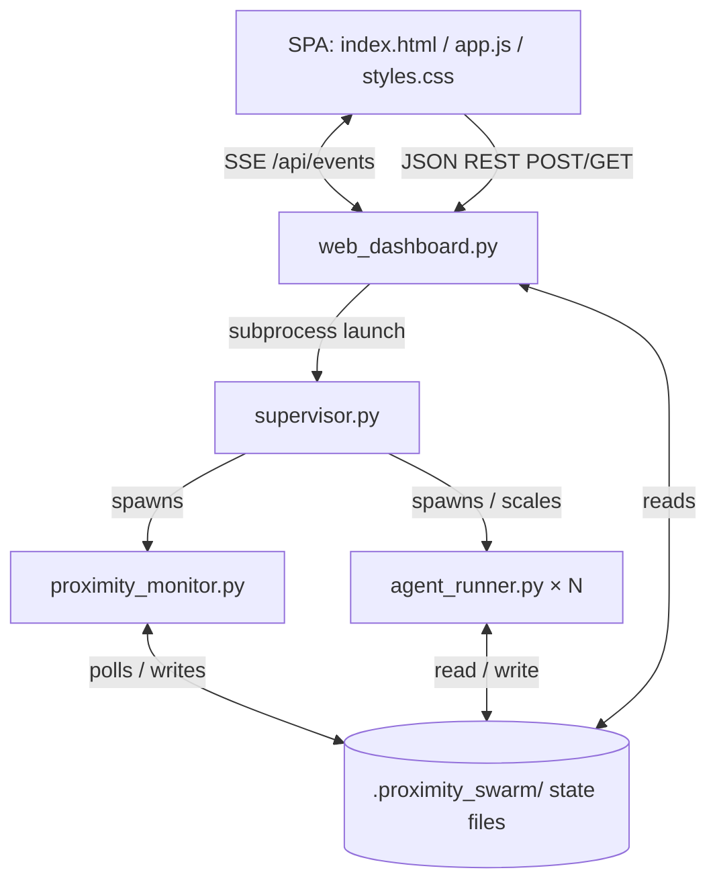

# Proximity Swarm V3 — UI Design & Backend Integration

This is the **authoritative specification** for the Proximity Swarm V3 web dashboard: the design
philosophy, the layout and components, how they fit together, how they talk to the backend, and a
coverage map proving every backend feature in [`design_doc.md`](design_doc.md) has a home in the UI.

The companion [`simplified_ui_design.md`](simplified_ui_design.md) records the motivation and the
before/after rationale; this document is the spec to build against.

---

## 1. Design philosophy

The dashboard is an **agentic IDE**, not a control panel. The visual and interaction language is
borrowed from **VS Code / Antigravity / Claude Code**, and the information architecture follows
six principles:

1. **Three persistent zones, one focus area.** Like an IDE: a *who* rail (left), a *what's
   happening* stage (center), an *output* editor (right). Everything else is summoned, not parked.
2. **Selection drives everything.** Click an agent once and the stage, editor, and inspector all
   follow it. The same agent is never re-picked in four places.
3. **Deep / rare views are drawers, not tabs.** Trace, Memory, budget controls, and the
   decision/collision feeds are pulled up when needed, then dismissed.
4. **Decisions come to you.** Pending spawns, blockers, and collisions surface inline in the
   Timeline **and** as a clickable count in the status bar — never hunted for in a tab.
5. **One way to see a thing.** No Workspace-vs-Editor or Overview-vs-Map duplication.
6. **VS Code / Antigravity chrome.** A far-left **activity bar**, VS Code editor **tabs**, and a
   **blue status bar** at the bottom. Flat gray surfaces, minimal radius, the VS Code palette
   already in `static/styles.css`.

This replaces the previous nine always-visible navigation targets (7 center tabs + 2 right-panel
tabs) with **3 panes + 1 center toggle + 2 on-demand drawers**.

---

## 2. System architecture

A single-page application that synchronizes in real time with an event-driven Python HTTP/SSE
server, which in turn launches and reads the file-based swarm state.



- The backend launches `supervisor.py` as a subprocess and surfaces swarm state by reading the
  `.proximity_swarm/` directory (agents, collisions, tombstones, memory.db, monitor.log) plus the
  causal-trace SQLite store.
- The SPA never talks to the supervisor directly — it polls/streams the backend, which is the
  single integration seam.

---

## 3. Layout

```
┌──────────────────────────────────────────────────────────────────────────────┐
│ ⬡ Proximity Swarm V3 — <project>            ▶ Running   ⚙ settings   + New swarm│  Title bar
├──┬───────────┬───────────────────────────────────────────┬─────────────────────┤
│⬡ │ AGENTS  N │  [ ◆ Map │ 💬 Timeline ]    ● Swarm optimal │ AuthForm.jsx ×  …   │
│◆ │ ▾ Orchestr│                                             │ src › … › jsx       │
│💬│  001 Lead │     ╭─ frontend ─╮     ╭─ api ─╮            │  3 export const     │
│🔍│ ▾ Frontend│     │ (002)●●●●  │     │(003◉) │            │  4  const[user]⌷002 │
│🔔│  002 lead │     │  ●●  (004) │     │ (006◍)│            │  …                  │
│  │  004 005  │     ╰────────────╯  ┄  ╰───────╯            │ [ Code │ Terminal ] │
│⚙ │ ▾ API …   │      ─ parent→child   ┄ redundancy ring     │                     │
├──┴───────────┴───────────────────────────────────────────┴─────────────────────┤
│ ❯ Enter a goal, command, or @agent_id message…                                  │  Command bar
├───────────────────────────────────────────────────────────────────────────────┤
│ ⎇ project  ● Running  ◆ N agents · M swarms  ⛁ used/cap   🔔 K decisions   Logs  │  Status bar (blue)
└───────────────────────────────────────────────────────────────────────────────┘
   ▲ activity bar    Inspector slides in from the right · Activity/Logs drawer rises from bottom
```

---

## 4. Components

### 4.1 Title bar
Brand (`⬡ Proximity Swarm V3`) + current project/branch label · a **Running/Idle/Completed** chip ·
a **settings ⚙** menu (holds the storage **clean** actions: logs, workspaces, collisions,
tombstones, memory, everything) · a **+ New swarm** button (opens the Init modal).

### 4.2 Activity bar (far left, VS Code)
A 44px icon switcher: **Agents** (default), **Swarm map**, **Timeline**, **Search**, **Activity**
(bell, with an attention dot), and **Settings** pinned at the bottom. It controls which side panel
/ stage view is active; it is the structural cue that this is an IDE.

### 4.3 Agents rail (left — the *who*)
A hierarchical tree grouped by **sub-swarm**: Orchestrator → each sub-swarm (lead + workers). Each
row shows **status badge · role · truncated goal · progress bar · mini token usage**. Worker-heavy
sub-swarms collapse the long tail to a `+ N workers` line. The rail is the **single source of
selection**:

- **Single-click** = *focus* the agent (highlights its map node, loads its files in the editor,
  re-scopes an open Inspector). Does **not** open the Inspector.
- **Double-click** or the row's **details icon** = open the Inspector for that agent.
- Row hover exposes quick actions (view workspace, view trace, edit goal/role, prune).

Replaces the old left sidebar **and** the Overview tab's agent grid.

### 4.4 Center stage — the **Map ⇄ Timeline** toggle
A segmented control flips the center between two paradigms. **Default: Map when >1 agent, Timeline
for a single agent.**

**Map — clustered network graph.** Agents group into **sub-swarms**, each drawn inside a soft
**boundary hull** (the design doc's "nested transparent boundary circles"); the cluster **lead**
sits central with **worker** agents packed around it, positioned organically. An **orchestrator
hub** floats above and connects down to each lead. Encoding:

- **Node label** — agent **ID** (`001`–`00N`) + role tag.
- **Solid directional edge** — parent → child (the spawn tree; readable inside the cluster shape).
- **Dashed amber link + glowing ring** — a cross-swarm **redundancy** collision (proximity spring).
- **Node fill / state** — green = exploring, amber = syncing, gray = idle, check = done.
- **Attention ring** — what the agent needs from *you*: **blue ring = needs input** (a pending
  spawn/blocker decision targets it), **orange ring = low token budget**.
- Faint ambient dots inside a hull hint at additional swarm members at scale.

**Timeline — conversation/activity stream** (Claude-Code style): your prompts, agent narration,
live code snippets, and **inline decision/collision cards**. Absorbs the old `Agent Chat` tab —
scopes to the selected agent or an `@mention`.

One toggle replaces three former tabs (Overview, Cluster Map, Agent Chat).

### 4.5 Editor (right — the *output*)
VS Code-style: **file tabs**, breadcrumb, syntax-highlighted contents with line numbers, and
**multiplayer agent cursors** (the "Agent 00N" labels from mockup 2). A collapsible
**Code ⇄ Terminal** switch at its foot. This one editor replaces the redundant `Workspace` tab +
`Code Editor` right-tab.

### 4.6 Inspector (on-demand, slides from the right — agent deep-dive)
Opens on double-click / details icon. Four sub-tabs scoped to the selected agent:

- **Overview** — role, current goal, task-similarity metrics to peers.
- **Budget** — this agent's token cap + usage, inline edit, and **redistribute to children**
  (equal / weighted / priority).
- **Trace** — the agent's causal lineage (spawns, steps, state transitions; Mermaid + timeline).
- **Memory** — similar past runs / episodes for this agent (swarm-wide via a header filter).

Collapses three former top-level tabs (Trace, Memory) plus the agent detail card into one panel.

### 4.7 Activity / Logs drawer (on-demand, rises from the bottom — swarm feeds)
Opens by clicking the status-bar **"K decisions"** count or **Logs** item. Two views:

- **Decisions & collisions** — pending spawn approvals (approve/reject), blocker resolutions
  (workaround / bypass / kill), live collisions, leaf-prune candidates, and tombstones.
- **Logs** — the `monitor.log` stream.

### 4.8 Command bar (persistent, bottom)
The agentic REPL: `❯ Enter a goal, command, or @agent_id message…`. Accepts macro goals,
`/commands` (e.g. `/budget`, `/prune`, `/clean`, `/memory`, `/trace`), and `@agent_id` messages.
Unchanged from today.

### 4.9 Status bar (blue, very bottom — VS Code)
Glanceable global state: project/branch · **Running/Idle/Completed** · **N agents · M swarms** ·
**⛁ used / cap** global token budget (click to edit) · **K decisions** (click → Activity drawer) ·
warning count · **Logs** · provider · cursor position.

### 4.10 Init modal (empty state, mockup 3)
When `agents.length === 0`, the zones sit dimmed and a single **"Initialize Swarm Task"** modal
appears: prompt textarea, **provider** select, and a **compute budget** control rendered as
**segmented presets (Small / Medium / Large)** with an **"advanced → exact tokens"** reveal. The
**agent designer** (custom roles/goals, add/remove agents, with LLM recommendations) is an
expandable section inside this one modal — there is no separate launch modal.

---

## 5. Interaction & state model

One client-side `selectedAgentId` is the source of truth; selection propagates everywhere.

| Trigger | State update | Visual effect |
|---|---|---|
| **Single-click** agent in rail / map node | `selectedAgentId` | Map node highlights · Editor loads its files · open Inspector re-scopes. Does **not** open Inspector. |
| **Double-click** / details icon | `inspectorOpen`, `selectedAgentId` | Inspector slides in for that agent. |
| Toggle Map / Timeline | `stageView` | Center swaps; selection preserved. |
| Switch Inspector sub-tab | `inspectorTab` | Overview / Budget / Trace / Memory for `selectedAgentId`. |
| Decision arrives (SSE) | `decisions[]` | Inline Timeline card **+** status-bar "K decisions" increments; target node gets a **blue ring**. |
| Budget runs low (SSE) | agent budget | Target node gets an **orange ring**. |
| New swarm launch | `agents[]` (SSE) | Init modal fades; rail + Map populate. |
| Collision detected (SSE) | `collisions[]` | Dashed redundancy link + ring on Map; entry in Activity drawer. |

---

## 6. Backend integration

### 6.1 Server-Sent Events — `GET /api/events`
Persistent `EventSource`. The backend pushes the global `SwarmState` whenever the supervisor
mutates state (spawns, state transitions, collisions, step completions, budget changes). The
client diffs a state hash and re-renders only on change.

### 6.2 REST endpoints (as implemented in `web_dashboard.py`)

| Endpoint | Method | Purpose |
|---|---|---|
| `/api/state` | GET | Full swarm snapshot (bootstraps the SPA). |
| `/api/agents` | GET | Agent list. |
| `/api/agents/<id>` | GET | Single agent detail. |
| `/api/workspaces/<id>` | GET | An agent's files + contents (→ Editor). |
| `/api/trace/<id>` | GET | Causal trace (Mermaid + timeline) (→ Inspector ▸ Trace). |
| `/api/memory` | GET | Episodic memory list (→ Inspector ▸ Memory). |
| `/api/collisions` | GET | Active collisions (→ Map + Activity drawer). |
| `/api/tombstones` | GET | Dead/pruned agent records (→ Activity drawer). |
| `/api/logs` | GET | `monitor.log` tail (→ Logs drawer / Terminal). |
| `/api/config` | POST | Set LLM provider (Init modal). |
| `/api/run` | POST | Launch the supervisor swarm (Init modal). |
| `/api/add-agent` | POST | Register a designer agent (Init modal). |
| `/api/agents/<id>/preset` | POST | Edit a designer agent's role/goal before launch. |
| `/api/agents/<id>/edit` | POST | Edit a running agent's goal/role (Inspector / rail). |
| `/api/agents/<id>/chat` | GET/POST | Per-agent chat (→ Timeline). |
| `/api/approve/<id>` · `/api/reject/<id>` | POST | Resolve a spawn request (Activity drawer / Timeline card). |
| `/api/resolve/<id>` | POST | Resolve a blocker — `{choice: 1\|2\|3}` = workaround/bypass/kill. |
| `/api/prune/<id>` | POST | Prune a leaf agent. |
| `/api/budget` | POST | Set the global token budget cap (status bar). |
| `/api/agents/<id>/budget` | POST | Set a single agent's token cap (Inspector ▸ Budget). |
| `/api/budget/redistribute` | POST | Redistribute among children — `{strategy: equal\|weighted\|priority}`. |
| `/api/clean` | POST | Storage cleanup — `{target}` (settings menu). |

---

## 7. Feature coverage map (design_doc → UI)

Proof that every backend feature has a UI home in this layout.

| design_doc feature | UI surface |
|---|---|
| §1 Supervisor / monitor / runners | Whole dashboard (live state via SSE). |
| §2 Storage layout | Settings ▸ Clean targets; Editor/Workspaces; Logs drawer. |
| §3 Clean commands | **Settings ⚙ menu** + `/clean` in command bar. |
| §4 Swarm designer + LLM recommendations | **Init modal** (expandable agent designer). |
| §5 Deconfliction / collision negotiation | **Map** redundancy link/ring + **Activity drawer** collisions; resolve via `/api/resolve`. |
| §6 Verification & tests | Surfaced indirectly via step progress + Trace; logs in Logs drawer. |
| §7 Hierarchical artifact synthesis | **Report** button + `/view synthesis` open a Combined Deliverable modal (`GET /api/synthesis`, implemented). In the new layout this becomes the Editor's per-agent ⇄ synthesis toggle. |
| §8 Designer UI / command help | Init modal + command-bar placeholder/hints. |
| §9 Episodic memory | **Inspector ▸ Memory** (+ swarm-wide filter); `/memory`. |
| §10 Three-tier hierarchical scaling | **Map sub-swarm clusters** (hull = sub-swarm; hub = orchestrator). |
| §11 Dynamic proximity weighting (phase) | Computed internally; drives collision weighting on the Map. Not separately displayed today (planned: show the agent's current phase in Inspector ▸ Overview). |
| §12 Causal graph tracing | **Inspector ▸ Trace**; `/trace`. |
| §13 Self-healing verification loop | Step progress gated on verification; heals shown in Trace; exhaustion → tombstone in Activity drawer. |
| §14 Budget & leaf pruning | **Status-bar budget**, **Inspector ▸ Budget**, prune candidates + `/prune` in Activity drawer. |
| §15 Novelty / isolation spawning | Spawn requests as **Timeline cards / Activity drawer**; new child appears in its sub-swarm on the Map. |

**Build status.** All 15 backend features are surfaced in the shipping web UI today — including
§7 synthesis, newly added as the **Report** modal (`GET /api/synthesis`). This document specifies
the *target* IDE layout (activity bar · clustered Map ⇄ Timeline stage · Editor · Inspector ·
Activity/Logs drawer · blue status bar) shown in the approved interactive mockup; the shipping app
still uses the prior tabbed layout. The restructure is the recommended next implementation and is
shippable in the independent phases listed in [`simplified_ui_design.md`](simplified_ui_design.md) §6.

---

## 8. Visual tokens

Reuse the existing VS Code palette in `static/styles.css`: editor `#1e1e1e`, side/title `#252526`,
activity bar `#2d2d2d`, borders `#2b2b2b`/`#3e3e42`, accent blue `#007acc`, semantic
green `#4ec9b0` (exploring), amber `#cca700` (syncing), red `#f14c4c` (blocker), orange `#ce9178`
(low budget), text `#cccccc`/`#969696`. Flat surfaces, 3–4px radius, mono for IDs/code.
